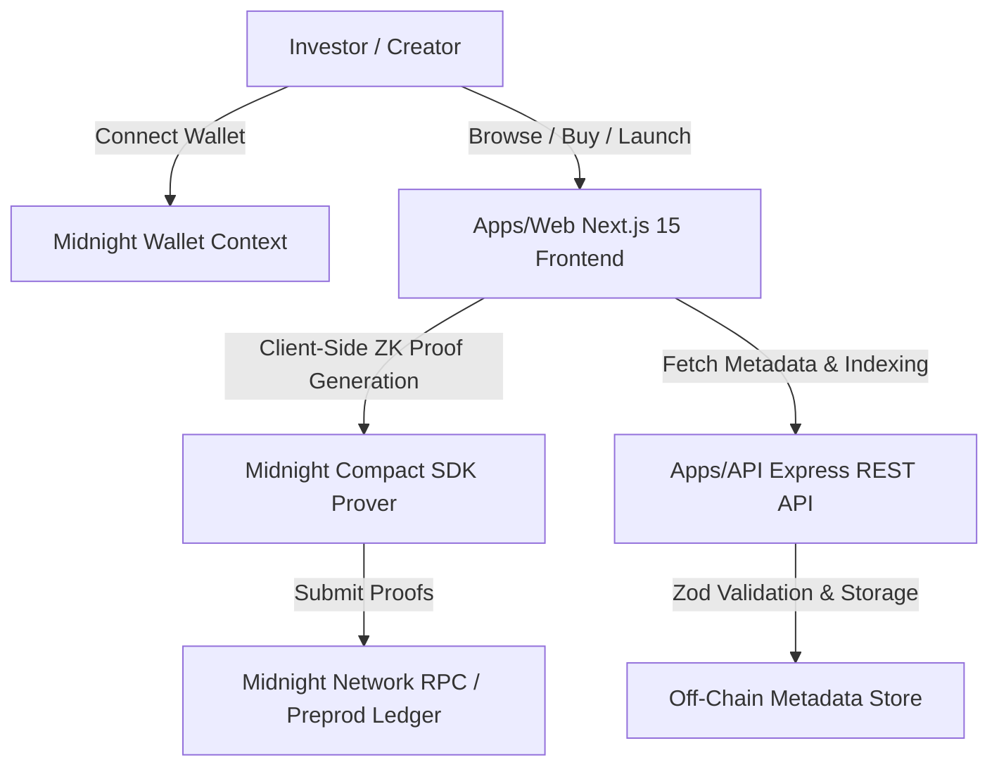

# PrivyMint — Privacy-First NFT Fractionalization Platform


> **Own Premium Digital Assets Together — Privately.**

PrivyMint is a privacy-first NFT fractionalization platform built natively for the **Midnight Network**. It enables high-value digital asset owners (collectors, DAOs, RWAs, gaming guilds, digital art collectives) to split NFTs into tradable fractional shares while preserving investor privacy using Midnight's zero-knowledge smart contracts.

---

## 🛑 The Problem

High-value NFTs (Cryptopunks, rare metaverse parcels, fine art, tokenized RWAs) are unaffordable for most individual retail collectors. However, traditional EVM-based fractionalization platforms expose:

- ❌ **Investor Identity**: Every wallet address interacting with the contract is public.
- ❌ **Portfolio Sizes & Wealth**: Anyone can audit an investor's exact holdings and net worth.
- ❌ **Purchase History**: Capital movements are 100% visible, deterring whales, institutional collectors, and DAOs who fear front-running and MEV bots.

---

## 🛡️ The Solution

PrivyMint leverages Midnight's domain-specific **Compact** smart contract language and zero-knowledge proving system to redefine digital asset co-ownership:

- **Lock & Fractionalize**: Asset owners lock an NFT into a Compact contract and issue fractional shares.
- **Private Share Purchases**: Investors purchase shares without revealing their wallet address, liquid capital, or total portfolio holdings.
- **Selective Ownership Verification (`disclose()`)**: Investors can generate zero-knowledge proofs to prove co-ownership (e.g., to join gated DAOs or governance portals) without disclosing their identity or exact holding balance.

### Data Privacy Breakdown

| Public Ledger Data | Private Zero-Knowledge Witness Data |
|--------------------|-------------------------------------|
| NFT IPFS Metadata Hash | Investor Wallet Address |
| Total Fractional Shares | Private Share Holding Count |
| Unit Share Price (DUST) | Capital Invested & Balance |
| Aggregate Sold Share Count | Individual Purchase & Transfer History |
| Listing Lifecycle Status | Transaction Witness Signatures |

---

## 🏗️ Architecture Overview



---

## 📁 Repository Structure

```
PrivyMint/
├── contracts/                  # Midnight Compact Smart Contracts
│   ├── privymint.compact       # Production Compact contract with ZK circuits
│   └── README.md               # Contract privacy model & compilation guide
├── apps/
│   ├── api/                    # Express REST API & Indexer Service
│   │   ├── src/                # TypeScript server source code
│   │   └── tests/              # Vitest API integration test suite
│   └── web/                    # Next.js 15 Web Application
│       └── src/                # React App Router pages, components, & context
├── docs/                       # Comprehensive System Documentation
│   ├── Architecture.md         # Detailed system design
│   ├── PrivacyModel.md         # Midnight ZK privacy specifications
│   ├── API.md                  # REST API endpoint documentation
│   ├── Roadmap.md              # Moonshots program progression
│   └── Contributing.md         # Open-source contribution guidelines
├── .github/
│   └── workflows/
│       └── ci.yml              # GitHub Actions CI workflow
├── context.md                  # Business context & target personas
├── research.md                 # Midnight SDK & ZK technical discoveries
├── plan.md                     # Master product roadmap
├── memory.md                   # Architecture tradeoff decisions
├── progress.md                 # Development progress tracker
└── README.md                   # Core Startup Documentation
```

---

## ⚙️ Quick Start & Local Setup

### Prerequisites

- **Node.js**: `^20.0.0` or higher
- **npm**: `^10.0.0` or higher
- **Compact Compiler**: `compact` version `0.5.1` (optional for contract verification)

### 1. Installation

```bash
git clone https://github.com/privymint/privymint.git
cd PrivyMint
npm install
```

### 2. Environment Configuration

Copy `.env.example` to create environment files:

```bash
cp apps/api/.env.example apps/api/.env
cp apps/web/.env.example apps/web/.env
```

### 3. Smart Contract Verification & Compilation

Verify the syntax of `privymint.compact`:

```bash
npm run contract:check
```

Build the circuit artifacts:

```bash
npm run contract:compile
```

### 4. Running Development Servers

Start the Express API server:

```bash
npm run dev:api
```

In a second terminal, start the Next.js web application:

```bash
npm run dev
```

Open [http://localhost:3000](http://localhost:3000) in your browser.

---

## 🧪 Testing

Run the API integration test suite:

```bash
npm run test
```

Run TypeScript type checks across all workspaces:

```bash
npm run typecheck
```

---

## 🚀 Smart Contract Deployment Guide

> **⚠️ Manual Deployment Policy**: Per protocol guidelines, smart contracts compile cleanly but are **NOT** deployed automatically.

To manually deploy `privymint.compact` to the Midnight Preprod network when ready:

```bash
compact deploy contracts/privymint.compact --network preprod
```

After deployment, set the output contract address in your environment configuration:

```env
CONTRACT_ADDRESS=<YOUR_DEPLOYED_CONTRACT_ADDRESS>
NEXT_PUBLIC_CONTRACT_ADDRESS=<YOUR_DEPLOYED_CONTRACT_ADDRESS>
```

---

## 🌙 Midnight Moonshots Program Progression

PrivyMint is engineered to fulfill every belt level of the **New Moon to Full: Monthly Moonshots on Midnight** program:

- **🌑 Level 1 — Compact Toolchain**: Fully specified `privymint.compact` smart contract verified with `compact` compiler.
- **🌒 Level 2 — Midnight Wallet Integration**: Integrated `WalletContext` abstraction supporting account connection and client-side ZK proof generation.
- **🌓 Level 3 — Production Full-Stack Application**: Next.js 15 frontend, Express backend, Zustand state management, TanStack React Query, and complete CI/CD pipeline.
- **🌔 Level 4 — Preprod MVP & Documentation**: Comprehensive documentation suite (`Architecture.md`, `PrivacyModel.md`, `API.md`, `Roadmap.md`), standalone ZK verifier tool, and clean monorepo architecture.
- **🌕 Level 5 — User Onboarding & Feedback Hooks**: Built-in beta feedback submission system (`/onboarding`), telemetry API endpoints, and onboarding event tracking for 50+ Preprod users.
- **🌝 Level 6 — Supermoon Mainnet Readiness**: Production-ready code quality, secondary market hooks (v0.2), DAO governance hooks (v0.3), and zero placeholder components.

---

## 📄 License

This project is licensed under the **MIT License** — see the [LICENSE](LICENSE) file for details.

---

<p center>
  Built with ❤️ for the <strong>Midnight Ecosystem</strong>
</p>
