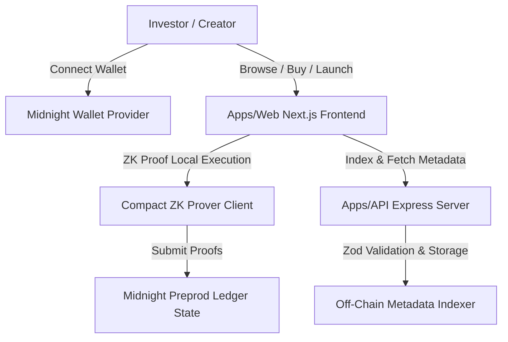

# PrivyMint — System Architecture & Engineering Design

## Executive Summary

PrivyMint is a privacy-first NFT fractionalization platform engineered natively for the Midnight Network. High-value digital assets (e.g., fine art, gaming items, virtual land, RWA assets) are locked into a Midnight Compact smart contract and split into tradable fractional shares.

Unlike traditional EVM marketplaces where all buyer identities, portfolio sizes, and transaction histories are exposed on-chain, PrivyMint keeps sensitive investor information private using Midnight's Zero-Knowledge (ZK) proving capabilities while keeping total share supply and listing metadata publicly verifiable.

---

## Monorepo Layout

PrivyMint follows a modular monorepo structure:

```
PrivyMint/
├── contracts/                  # Midnight Compact Smart Contracts
│   ├── privymint.compact       # Production Compact contract with ZK circuits
│   └── README.md               # Contract documentation & compilation guides
│
├── apps/
│   ├── api/                    # Express REST API & Off-Chain Indexer
│   │   ├── src/
│   │   │   ├── index.ts        # Server entry point with security middleware
│   │   │   ├── routes/         # REST endpoints (offerings, proofs, feedback)
│   │   │   ├── store/          # Data persistence layer abstraction
│   │   │   ├── types/          # Shared TypeScript type definitions
│   │   │   └── validation/     # Zod schema validation
│   │   └── tests/              # Vitest API integration tests
│   │
│   └── web/                    # Next.js 15 Web Application
│       ├── src/
│       │   ├── app/            # App Router pages (Home, Marketplace, Portals)
│       │   ├── components/     # Glassmorphic UI component library
│       │   ├── context/        # Midnight Wallet provider & state
│       │   ├── lib/            # API client & utility functions
│       │   └── types/          # Frontend type definitions
│       └── tailwind.config.js  # Dark mode glassmorphic theme
│
├── docs/                       # Project Documentation Suite
│   ├── Architecture.md         # System design & ZK flow
│   ├── PrivacyModel.md         # Midnight zero-knowledge privacy specs
│   ├── API.md                  # REST API specification
│   ├── Roadmap.md              # Moonshots program progression
│   └── Contributing.md         # Guidelines for open-source contributors
│
├── .github/
│   └── workflows/
│       └── ci.yml              # GitHub Actions (Build, Lint, Test, Compact)
│
├── README.md                   # Core Startup Overview
├── LICENSE                     # MIT License
└── package.json                # Root npm workspace configuration
```

---

## Core Components



### 1. Compact Smart Contract Layer (`contracts/privymint.compact`)
- Written in Compact 0.5.x for Midnight Network.
- Maintains public ledger state for total supply, unit share price, aggregate sold shares, and IPFS metadata CID hash.
- Implements private `witness` declarations for investor holding balances, nonces, and identity commitments.
- Provides 8 public circuits: `createFraction`, `buyShares`, `sellShares`, `transferShares`, `claimOwnership`, `verifyOwnership`, `cancelOffering`, and `closeOffering`.

### 2. Express API & Off-Chain Indexer (`apps/api`)
- Serves as the indexer for public offering metadata, category filtering, search, and analytics aggregation.
- Implements Zod schema validation for strict request sanitization.
- Exposes ZK proof structural verification endpoints and challenge nonce generation.
- Handles Moonshots Level 5 feedback and onboarding telemetry.

### 3. Next.js Web Frontend (`apps/web`)
- Dark-mode first UI using a custom purple + midnight blue palette with glassmorphism styling.
- Framer Motion micro-animations for card hovers and ZK proof generation modals.
- Integrated Midnight Wallet state provider with Zustand persistence.
- Complete pages for Landing, Marketplace, Fraction Detail, Investor Portal, Creator Hub, Standalone ZK Verifier, and Beta Onboarding.

---

## Deployment & Security Guarantees

1. **No Automatic Contract Deployment**: The contract compiles cleanly with `compact compile`, but deployment is deferred to manual execution.
2. **Input Validation**: All API bodies and Compact circuit arguments are bound by mathematical constraints and Zod runtime checks.
3. **Replay Attack Prevention**: Session nonces are passed into local witness declarations to ensure proof uniqueness.
